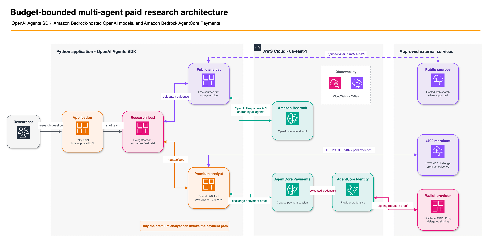

# Tutorial 08 - Budget-Bounded OpenAI Multi-Agent Research

| Information | Details |
|:------------|:--------|
| Tutorial type | Task-based, advanced |
| Agent type | Multi-agent (research lead + two specialists) |
| Agentic framework | OpenAI Agents SDK |
| LLM model | OpenAI model hosted on Amazon Bedrock |
| Components | AgentCore Payments, `PaymentManager`, x402 |
| Example complexity | Advanced |

> **Reads** `PAYMENT_MANAGER_ARN`, `INSTRUMENT_ID`, `USER_ID`, and
> `AWS_REGION` from Tutorial 00's shared `.env`. **Does** create a fresh
> budget-bounded payment session and run an OpenAI Agents SDK research team in
> which only one specialist can buy evidence.

## Overview

This tutorial demonstrates one control boundary: an agent may request paid
evidence, but it cannot choose a different merchant or change the session
budget. The application binds one x402 URL, and AgentCore Payments enforces the
maximum spend and expiry outside model context.

The starter is intentionally incomplete so you can implement the important
parts yourself. Follow [BUILD.md](BUILD.md) for the exercise and acceptance
tests.



The same image is used here and in the notebook. This tutorial contains no
duplicate SVG, high-resolution, or draw.io versions.

## Architecture

| Component | Responsibility |
|---|---|
| Research lead | Delegates and writes the final brief |
| Public evidence analyst | Analyzes supplied public evidence without payment access |
| Premium evidence analyst | Calls the single application-bound x402 tool |
| Application | Selects the merchant URL and creates the per-run session |
| AgentCore Payments | Enforces the budget and expiry, then generates payment proof |

All three agents use the OpenAI Responses API through Amazon Bedrock. There is
no direct OpenAI API fallback and no `BEDROCK_OPENAI_ENABLED` switch.

## Prerequisites

- Complete [Tutorial 00](../00-setup-agentcore-payments/).
- Choose a provider using the canonical
  [wallet-provider setup](../00-setup-agentcore-payments/providers/).
- Fund and delegate the Tutorial 00 testnet wallet.
- Use Python 3.10+ and AWS credentials with access to the configured Bedrock
  model and AgentCore Payments resources.

Provider credentials remain in the Tutorial 00 setup path. This tutorial reads
only the resulting manager, instrument, and user identifiers.

## Setup

```bash
python -m venv .venv
source .venv/bin/activate
pip install -r requirements.txt
cp .env.example .env
```

The local `.env` contains tutorial overrides only. The wallet information is
loaded from the shared `../.env`.

## Build the Exercise

Run the starter tests:

```bash
pytest -q
```

Then complete the three TODOs described in [BUILD.md](BUILD.md):

1. Create a per-run payment session.
2. Implement the x402 `GET -> 402 -> pay -> retry` exchange.
3. Build the three-agent manager pattern with payment authority isolated to the
   premium specialist.

## Run

After all tests pass:

```bash
python openai_paid_research.py \
  "Assess the material near-term drivers and risks for AMZN."
```

The configured `PAID_RESEARCH_URL` is captured by the application tool and is
never exposed as a model-controlled argument.

## Notebook

The guided starter notebook is
[`notebooks/openai_paid_research.ipynb`](notebooks/openai_paid_research.ipynb).
It imports the same Python files and references the same architecture image;
it does not duplicate either implementation or image data.

## Verify

```bash
pytest -q
ruff check .
ruff format --check .
```

The live run should show that the public analyst runs first, only the premium
analyst can call the payment tool, and a purchase cannot exceed the payment
session's hard limit.

## Clean Up

Payment sessions expire automatically. The shared manager, connector, and
instrument belong to Tutorial 00; follow its
[cleanup instructions](../00-setup-agentcore-payments/#cleanup) when all
payments tutorials are complete.
